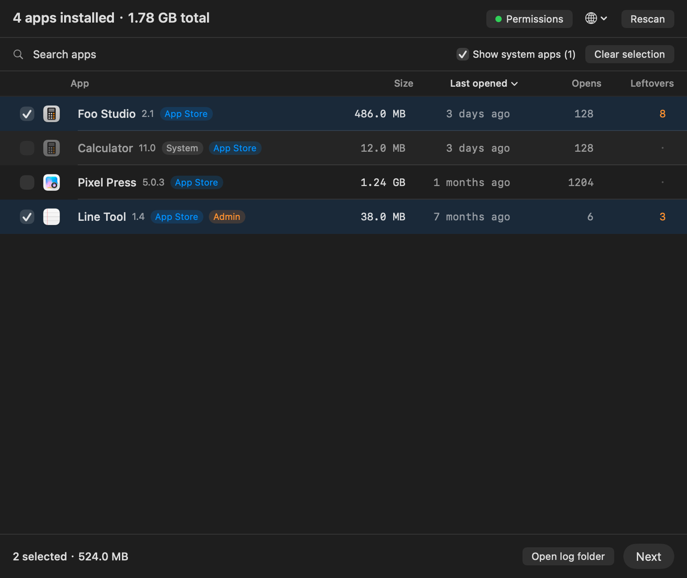
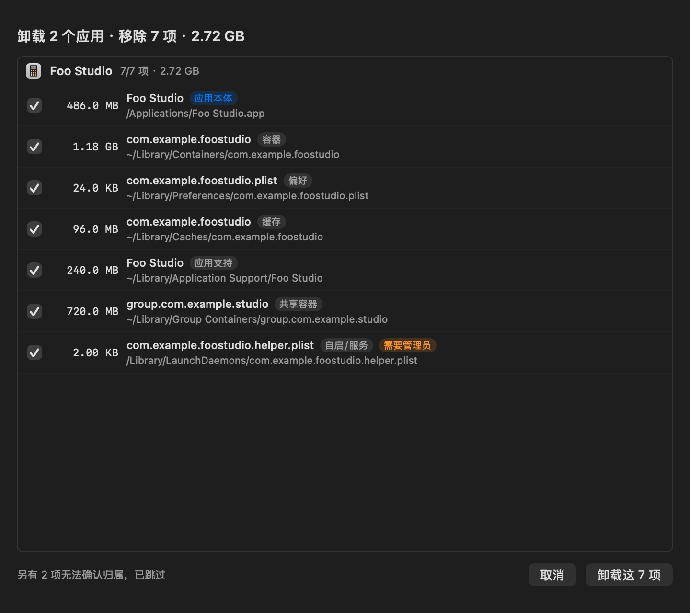
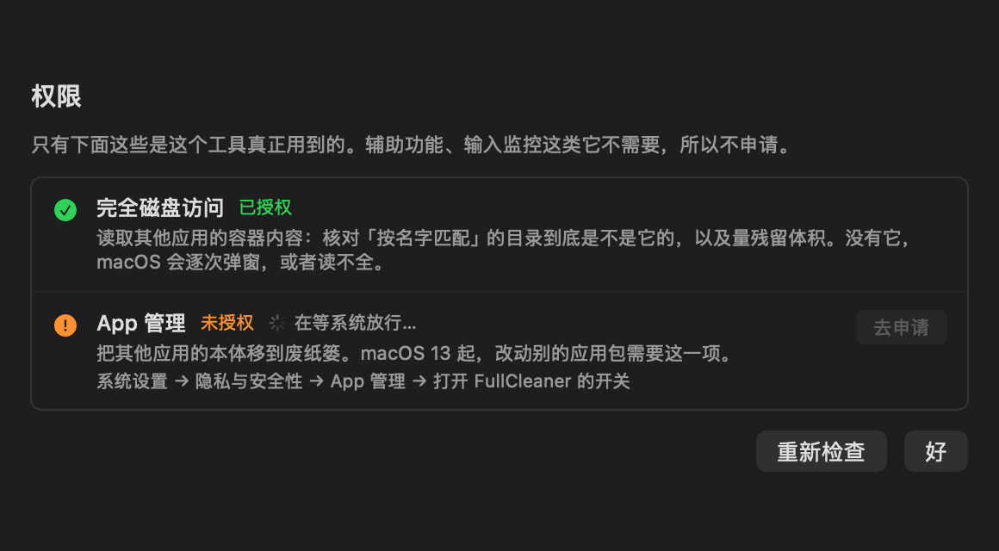

# FullCleaner

A macOS uninstaller that removes an app **and everything it left behind** — and refuses to delete what it cannot prove belongs to that app.

Dragging an app to the Trash deletes `/Applications/Foo.app`. The rest stays: sandbox containers, group containers, preferences, caches, HTTP storage, autosave state, launch agents, system-level leftovers, package receipts, and the permission records macOS keeps for the app (Accessibility / Input Monitoring / Full Disk Access). FullCleaner finds those, shows you the list item by item, and removes them after you confirm.



## Overview

- **Scan**: reads every installed app (bundle id, size, last opened, launch count, how many leftovers it has).
- **Plan**: matches leftovers to the app using evidence, not guesses (see [Safety](#safety)).
- **Remove**: moves items to the Trash, resets the app's permission records, unloads its launch agents, and logs every path with its Trash location.
- **Verify**: after removal it re-checks each path and reports what survived instead of claiming success.

Two ways to use it: a small GUI (multi-select, table with columns) and the same binary as a CLI.

## Safety

The tool's job is to decide what belongs to an app. It only acts on items it can prove:

| Evidence | How it is matched | Default |
| --- | --- | --- |
| Bundle id | Folder name equals the app's bundle id, or starts with it (`…helper`, `…cli`) | Selected |
| Declared container | App Group declared in the app's own code signature, **and no other installed app declares it** | Selected |
| Verified name match | Folder named after the app, **and the app's bundle id / path / executable name was actually read inside it** | Selected |
| Name only | Folder name looks like the app, nothing found inside | **Not listed, not deleted** |

Anything uncertain never reaches the UI: name-only matches, containers another installed app also uses, and iCloud Drive data (deleting it affects your other devices) are skipped, counted in one line at the bottom, and written to the log. You are never asked to adjudicate a match the tool could not make.

Hard gates run before anything is deleted:

1. **Protected paths** — `/System`, `/usr`, `/bin`, `/etc`, `/var`, `/Volumes`, Apple's own apps, `~/Documents`, `~/Desktop`, `~/Downloads`, home and `~/Library` themselves, and macOS preferences (`com.apple.*.plist`).
2. **Path shape** — absolute, existing, **not a symlink**, still inside the allow-list after resolving symlinks; app bundles only from `/Applications` or `~/Applications`.
3. **No collateral damage** — a parent and its child in the same batch keeps only the parent; a path claimed by two selected apps is dropped; a container another app uses is blocked and named.
4. **App quit** — quit, then force-quit; if it still runs, that app is left completely alone.
5. **Same volume** — nothing on another disk or network volume.

## Usage

Install: open `FullCleaner-<version>.dmg` and drag **FullCleaner** into Applications. Builds are ad-hoc signed and not notarized, so the first launch may need **right-click → Open** (or `xattr -d com.apple.quarantine /Applications/FullCleaner.app`).

GUI: check one or more apps (the table shows size, last opened, launch count, leftover count — **click a column header to sort by it, click again to reverse**) → **Next** → review the list → **Uninstall**.

CLI (same binary):

```sh
fullcleaner --list                          # installed apps with sizes, last opened, launch count
fullcleaner --list --json
fullcleaner --plan "Docker"                 # print the removal plan for one app; read-only
fullcleaner --plan com.docker.docker --json
fullcleaner --uninstall "Docker" --yes      # execute (requires --yes)
fullcleaner --permissions                   # system permission status (two items only)
fullcleaner --selftest                      # run the 72-assertion self test in a temp sandbox
fullcleaner --help
```

`--plan` never touches a file. `--uninstall` without `--yes` exits with a usage error.

Deletion goes to the Trash by default; root-owned items (App Store app bundles, files under `/Library`, package receipts) are batched into **one** administrator prompt and removed permanently — the review sheet says so before you confirm. Every run writes a JSONL log to `~/Library/Logs/fullcleaner/` including the Trash location of each item, and prunes itself to the last 20 runs.



## Permissions

FullCleaner asks for exactly two system permissions, each with its own button in the in-app **权限 / Permissions** panel (green check when granted, one-click request when not):

| Permission | Why it is needed |
| --- | --- |
| **Full Disk Access** | Read inside other apps' containers — that is how a folder named after an app is verified to actually belong to it, and how leftover sizes are measured. Without it macOS prompts repeatedly or reads come back incomplete. |
| **App Management** | Move another app's bundle to the Trash. Since macOS 13, modifying a bundle you do not own requires it. |

It does **not** ask for Accessibility or Input Monitoring: it never simulates keystrokes and never reads what you type.

```sh
fullcleaner --permissions          # status of both, exit code 0 when both are granted
```



## Install

```sh
./tools/install.sh                 # build + copy into /Applications the right way + launch
```

`install.sh` uses `ditto` (a `cp -R` copy loses bundle metadata and Finder then shows the app as a folder), marks the bundle bit, re-registers it with Launch Services and refreshes Finder's icon cache.

## Build

```sh
./build.sh
```

Requirements: macOS 13+, Xcode Command Line Tools (`xcode-select --install`). No Xcode project, no third-party dependencies — `swiftc` compiles `src/*.swift` for `arm64` and `x86_64`, `lipo` merges them into one universal binary, then the script assembles the `.app`, runs the self test, and packages a `.dmg` into `build/`.

Set `SIGN_IDENTITY="Developer ID Application: …"` to sign with a real certificate (hardened runtime + timestamp) instead of ad-hoc.

## Release

```sh
./tools/release.sh            # universal build → Developer ID signing → notarization → stapling → dist/
./tools/release.sh --dry-run  # print every step without touching anything
```

`tools/notarize.sh` submits the disk image with `xcrun notarytool`, staples the ticket, and validates with `spctl`. One-time setup (Apple ID, app-specific password, team ID) is documented at the top of the script and in [docs/release-checklist.md](docs/release-checklist.md).

## Verification

| Check | Command | Result |
| --- | --- | --- |
| Matching, gates, permissions, sorting, removal, logging | `fullcleaner --selftest` | **72 assertions**, run inside a temp sandbox (fake apps, fake leftovers, fake `/Library`); includes "every deleted path is inside the sandbox" and "paths with quotes and spaces are deleted correctly, nothing else is" |
| No network | `./tools/offline-test.sh` | source scan, `otool -L` / `nm -u` / `strings` on the binary, and a live `lsof` sample during a real scan → 0 connections |
| Release hygiene | `./tools/release-audit.sh` | 40 checks: personal info, secrets, license, repo hygiene, build, runtime safety, docs, publish prerequisites, full git history |
| UI layout | `--render`, `--render-review`, `--render-permissions`, `--render-result` | renders the interface to PNG offscreen, no screen-recording permission needed → `docs/screenshot-*.png` |

## Limitations

- **Keychain items are not touched.** They cannot be enumerated safely without dumping the whole keychain.
- **Login-item records in System Settings** may linger as a greyed row until the next login; the runtime service itself is unloaded with `launchctl`.
- **Name-only matches are skipped**, so the plan is not necessarily "every trace of the app on disk". Skipped items are counted and logged.
- On recent macOS versions the system may ask for consent the first time the app reads inside another app's container (that is how name matches get verified).
- Tested on macOS 13–27. Shipped as a universal binary; only Apple silicon was available for testing (x86_64 was exercised through Rosetta).
- Deleting through the Trash does not free space until you empty it.

## Privacy

No network code (three independent checks), no telemetry, no analytics, no personal data in the repository. Scanning is read-only; nothing is removed until you confirm a reviewed list. Logs stay local in `~/Library/Logs/fullcleaner/`.

## License

MIT — see [LICENSE](LICENSE).
